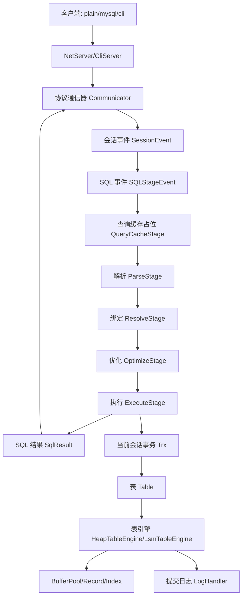
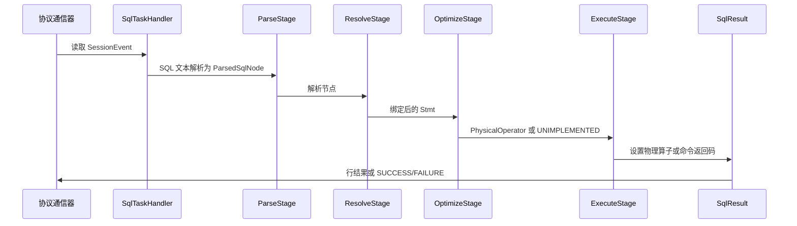
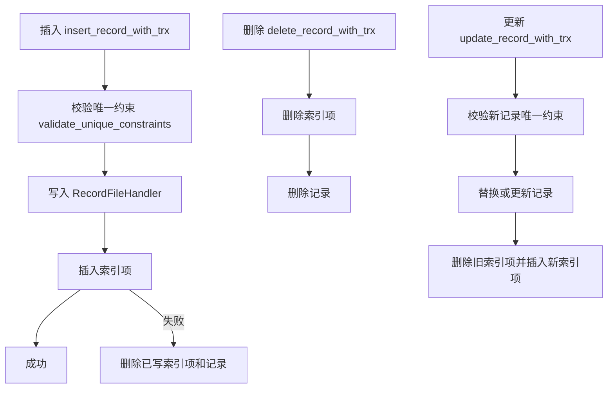
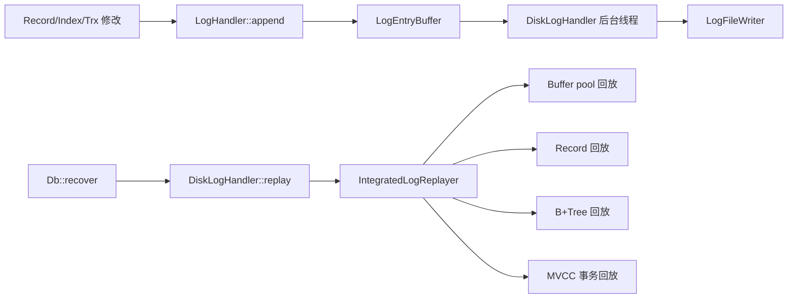

# MiniOB 内核架构说明

本文档梳理当前仓库中的 MiniOB 内核实现，重点覆盖 `src/observer` 下的网络入口、会话管理、SQL 编译执行、优化器、算子、存储、事务、WAL、索引、LSM 以及本地测试体系。说明基于当前代码状态，而不是上游 MiniOB 的抽象设计。

## 1. 整体架构

MiniOB 当前是一个单进程数据库内核。`observer` 进程启动后完成全局初始化，打开默认 `sys` 数据库，然后监听 plain、MySQL 或 CLI 协议请求。每条 SQL 请求经过阶段式流水线处理：读取请求、解析 SQL、绑定语义、重写优化、生成物理计划、执行计划并返回结果。



主要纵向依赖关系如下：

```text
net/event/session
  -> sql/parser + sql/stmt
  -> sql/optimizer
  -> sql/operator + sql/executor
  -> storage/table + storage/trx
  -> storage/record/index/buffer/clog
```

从职责上看，网络层只负责协议收发和连接调度；SQL 前端负责把文本变成带类型和表结构信息的 `Stmt`；优化层把 `Stmt` 变成逻辑计划并选择物理算子；执行层通过算子访问事务和表；存储层最终负责记录、索引、页缓存、日志和恢复。

## 2. 进程启动与全局状态

### 2.1 入口

`src/observer/main.cpp` 是 `observer` 进程入口，主要工作包括：

- 解析命令行参数，例如 `-P plain|mysql|cli` 选择协议，`-t vacuous|mvcc|lsm` 选择事务模型，`-d` 开启磁盘持久化，`-E heap|lsm` 选择表存储引擎，`-T one-thread-per-connection|java-thread-pool` 选择线程模型。
- 调用 `init(the_process_param())` 初始化配置、日志、全局上下文和默认处理器。
- 根据协议构造 `NetServer` 或 `CliServer`。
- 调用 `serve()` 进入服务循环，退出时调用 `cleanup()` 清理资源。

### 2.2 初始化

`src/observer/common/init.cpp` 负责初始化运行环境：

- 从 `etc/observer.ini` 读取配置。
- 初始化日志系统。
- 初始化 `GlobalContext`。
- 初始化 `DefaultHandler`。

`GlobalContext` 定义在 `src/observer/common/global_context.*`，保存进程级对象。当前最重要的对象是 `GCTX.handler_`，类型为 `DefaultHandler`。

### 2.3 默认数据库根目录

`src/observer/storage/default/default_handler.cpp` 管理数据库目录，默认路径形态为：

```text
miniob/db/<db-name>
```

启动时会创建或打开 `sys` 数据库，并把它设置为 `Session::default_session()` 的当前数据库。代码层面有多数据库结构，但当前实现主要围绕默认数据库运行，跨数据库能力较弱。

## 3. 网络、会话与请求生命周期

### 3.1 服务端与协议通信器

`src/observer/net/server.cpp` 负责监听 TCP 或 Unix socket 连接，并为每个连接创建一个 `Communicator`：

- `PlainCommunicator` 实现 MiniOB plain 协议，使用空字符结尾的请求格式。
- `MysqlCommunicator` 实现 MySQL 协议子集，主要用于 sysbench 和 MySQL 兼容客户端。
- `CliCommunicator` 实现标准输入输出模式。

连接执行交给 `src/observer/net/` 下的 `ThreadHandler` 实现。当前支持一连接一线程和 Java 风格线程池两类线程模型。

### 3.2 会话

`src/observer/session/session.cpp` 保存每个连接的会话状态：

- 当前 `Db`。
- 当前事务对象。
- 执行模式，例如 tuple iterator 或 chunk iterator。
- 优化器开关，例如 hash join、cascade optimizer。
- 线程局部的 `Session::current_session()`。

`Session::current_trx()` 会按需从当前数据库的 `TrxKit` 创建事务对象。显式事务和自动提交都依赖该入口。

### 3.3 请求对象流转

`SqlTaskHandler::handle_event` 是 plain/MySQL 网络路径下的单条 SQL 分发入口：

1. `Communicator::read_event` 读取请求并创建 `SessionEvent`。
2. `SessionStage::handle_request2` 绑定当前线程会话和当前请求。
3. `SQLStageEvent` 包装 SQL 字符串、解析节点、语句对象和物理算子。
4. `SqlTaskHandler::handle_sql` 顺序执行 `QueryCacheStage`、`ParseStage`、`ResolveStage`、`OptimizeStage`、`ExecuteStage`。
5. `Communicator::write_result` 从 `SqlResult` 拉取结果并按协议返回客户端。

`QueryCacheStage` 当前只是流水线占位，直接返回 `RC::SUCCESS`，没有实际缓存命中或短路逻辑。源码中也存在 `PlanCacheStage`，但它不在当前 `SqlTaskHandler` 的正常执行路径中。



## 4. SQL 前端

### 4.1 解析器

SQL 语法位于 `src/observer/sql/parser/`：

- `lex_sql.l` 是词法文件。
- `yacc_sql.y` 是语法文件。
- `lex_sql.cpp`、`lex_sql.h`、`yacc_sql.cpp`、`yacc_sql.hpp` 是生成文件。
- `parse_defs.h` 定义解析产物结构，例如 `SelectSqlNode`、`ConditionSqlNode`、`CreateTableSqlNode`。

`ParseStage` 调用 `parse(sql, ParsedSqlResult*)`，并把单条 `ParsedSqlNode` 保存到 `SQLStageEvent`。解析失败通常返回 `RC::SQL_SYNTAX`，plain 协议最终输出 `FAILURE`。

### 4.2 语义绑定

`ResolveStage` 通过以下入口把解析节点绑定成语句对象：

```cpp
Stmt::create_stmt(db, *sql_node, stmt)
```

`src/observer/sql/stmt/` 中的语句对象负责 schema 感知的校验和绑定：

- `SelectStmt` 解析表、投影、过滤、分组、聚合、having、排序、union、子查询和别名。
- `InsertStmt`、`UpdateStmt`、`DeleteStmt` 校验目标表、字段、表达式、view 改写和物化视图镜像 DML。
- `CreateTableStmt`、`CreateIndexStmt`、`Drop*Stmt`、`AnalyzeTableStmt` 负责 DDL 绑定。
- `FilterStmt` 把条件节点转换为带类型的 `Expression` 树。

字段歧义、字段不存在、类型检查、子查询关联关系、view 是否可更新等问题主要在绑定阶段暴露。

## 5. 表达式系统

表达式位于 `src/observer/sql/expr/`，被过滤、投影、DML 赋值、聚合、排序和 join 条件复用。

主要表达式类型包括：

- `ValueExpr`：字面量常量。
- `FieldExpr`：表字段引用。
- `ComparisonExpr`：比较运算、`IN`、子查询比较和 NULL 语义。
- `ConjunctionExpr`：AND/OR 组合。
- `ArithmeticExpr`：算术表达式和一元表达式。
- `CastExpr`：显式或隐式类型转换。
- `FunctionExpr`：标量函数和全文检索打分函数。
- `AggregateExpr` 及聚合状态类：`COUNT`、`SUM`、`AVG`、`MIN`、`MAX`。
- `SubQueryExpr`：执行嵌套查询计划，并按相关性缓存或刷新结果。

`src/observer/common/type/` 下的 `Value` 和类型实现负责值比较、序列化、NULL 标记、浮点格式、日期、向量、文本以及隐式转换。

## 6. 优化与计划生成

### 6.1 逻辑计划

`LogicalPlanGenerator` 把 `Stmt` 转换为 `LogicalOperator` 树：

- `SelectStmt` 通常生成 `TableGetLogicalOperator`、左深 `JoinLogicalOperator`、`PredicateLogicalOperator`、`GroupByLogicalOperator`、`OrderByLogicalOperator`、`ProjectLogicalOperator`，必要时还会生成 `UnionLogicalOperator`。
- DML 语句生成 `InsertLogicalOperator`、`UpdateLogicalOperator`、`DeleteLogicalOperator`。
- `ExplainStmt` 包装子计划生成 explain 逻辑算子。

初始逻辑计划保持简单，谓词位置、join 条件和下推等改写交给后续规则处理。

### 6.2 重写规则

`OptimizeStage::rewrite` 循环执行 `Rewriter`，直到没有规则继续改变计划。当前主要规则包括：

- `ExpressionRewriter`：简化和规范化表达式。
- `PredicateRewriteRule`：移除恒真谓词，并处理恒假谓词子节点。
- `PredicateToJoinRewriter`：把同时引用 join 两侧的谓词移动到 join 条件中；常量 join 条件会保留在 join 上。
- `PredicatePushdownRewriter`：把只引用单表的谓词下推到 `TableGetLogicalOperator`。

这些规则属于基于规则的优化，直接原地修改逻辑计划树。

### 6.3 物理计划

`PhysicalPlanGenerator` 把逻辑算子映射为 tuple iterator 物理算子：

- `TableGet` 映射为 `TableScanPhysicalOperator` 或 `IndexScanPhysicalOperator`。
- `Join` 在开启 hash join 且能找到等值键时映射为 `HashJoinPhysicalOperator`，否则映射为 `NestedLoopJoinPhysicalOperator`。
- `Project`、`Predicate`、`GroupBy`、`OrderBy`、`Union`、DML 和 `Explain` 分别映射到对应物理算子。

当前还支持部分向量化物理算子：

- `TableScanVecPhysicalOperator`
- `ProjectVecPhysicalOperator`
- `GroupByVecPhysicalOperator`
- `AggregateVecPhysicalOperator`
- `ExprVecPhysicalOperator`

`OptimizeStage` 会在会话处于 `ExecutionMode::CHUNK_ITERATOR` 且逻辑根节点支持向量化时调用向量化计划生成，否则使用 tuple iterator 路径。

### 6.4 Cascade 优化器

`src/observer/sql/optimizer/cascade/` 中包含实验性的 Cascades 风格优化器：

- memo/group 结构。
- 逻辑 join 到 hash join/NLJ 的实现规则。
- 成本模型。
- 任务调度器。

该优化器通过会话变量 `use_cascade` 开启。当前兼容性路径仍以非 cascade 的规则优化和物理计划生成为主。

## 7. 执行层

### 7.1 命令与查询的分流

`ExecuteStage` 分两类处理：

- 如果 `OptimizeStage` 已经生成 `PhysicalOperator`，则把物理算子移动到 `SqlResult`。
- 如果没有物理计划，则调用 `CommandExecutor` 执行 DDL、事务命令、变量设置、导入数据、查看表等命令型语句。

`SqlResult::open()` 会按需启动事务并打开物理算子。`SqlResult::close()` 关闭算子，并在非显式多语句事务模式下自动提交或回滚。

### 7.2 算子迭代接口

物理算子实现 Volcano 风格接口：

```cpp
open(Trx *)
next()
current_tuple()
close()
```

向量化算子额外支持 `next(Chunk&)`。

plain 协议输出通过 `SqlResult` 拉取 tuple 或 chunk，先打印 `TupleSchema` 表头，再打印数据行。DDL/DML 成功或失败严格输出 `SUCCESS` 或 `FAILURE`。

### 7.3 关键物理算子

- `TableScanPhysicalOperator`：扫描 `RecordScanner`，应用存储层和事务层可见性，并执行必要过滤。
- `IndexScanPhysicalOperator`：通过 `IndexScanner` 获取 RID，再读取记录。
- `PredicatePhysicalOperator`：执行布尔表达式过滤。
- `ProjectPhysicalOperator`：计算并格式化 select 表达式。
- `NestedLoopJoinPhysicalOperator`：双层迭代子算子，并执行 join 谓词。
- `HashJoinPhysicalOperator`：构建和探测 hash key，同时保留 residual 谓词判断。
- `GroupByPhysicalOperator`、`HashGroupByPhysicalOperator`、`ScalarGroupByPhysicalOperator`：执行聚合和分组。
- `OrderByPhysicalOperator`：物化 tuple 并排序，支持 limit。
- `UnionPhysicalOperator`：执行 union/union all。
- `InsertPhysicalOperator`、`UpdatePhysicalOperator`、`DeletePhysicalOperator`：通过事务接口执行 DML，并在需要时维护物化视图镜像。

## 8. View 与物化视图

当前 `create view` 由 `CommandExecutor::create_materialized_view` 实现为物化视图创建：

1. 解析并绑定 view 的 select SQL。
2. 根据 select 表达式推导输出 schema。
3. 为 view 创建一张物理表。
4. 执行 select 计划，把结果插入 view 物理表。
5. 在 `Db` 中注册 `ViewDefinition`。

`ViewDefinition` 记录以下元数据：

- view 名称。
- 基表名称。
- view 字段到基表字段的映射。
- 单表过滤 view 的谓词。
- 是否可更新。
- 是否完整镜像基表。

`Db::views_` 中的 view 定义注册表是进程内元数据。view 表本身通过普通 DDL 创建并落盘，但可更新性、字段映射和镜像关系这类额外元数据不是独立持久化 catalog。

当前 DML 规则如下：

- 单表字段投影视图可以在满足条件时更新。
- 多表、聚合、分组以及其它不支持的 view 不可更新。
- 完整基表镜像 view 会在基表或 view 表发生 DML 时通过镜像计划保持同步。

因此当前 view 实现是混合模型：数据以物理表形式保存，同时依赖额外内存元数据完成有限的 DML 改写和镜像维护。

## 9. 存储架构

### 9.1 数据库对象

`Db` 定义在 `src/observer/storage/db/db.*`，负责管理：

- 表注册表 `opened_tables_`。
- view 注册表。
- `BufferPoolManager`。
- 双写缓冲区。
- `LogHandler`。
- 事务 kit。
- 可选的 `ObLsm`。
- 数据库恢复流程。

`Db::init` 的启动顺序大致是：

1. 打开 LSM 目录。
2. 创建事务 kit。
3. 初始化 buffer pool 和 double write buffer。
4. 初始化 clog handler。
5. 加载数据库元数据。
6. 打开所有表。
7. 恢复 double write buffer。
8. 回放 WAL 日志。

### 9.2 Table 与 TableEngine 分层

`Table` 是 schema 层 façade，保存 `TableMeta` 并把实际读写委托给 `TableEngine`：

- `HeapTableEngine`：常规页式 heap 表。
- `LsmTableEngine`：实验性的 LSM 表引擎。

`Table::make_record` 把 SQL 层 `Value` 数组转换为物理 record 字节：

- 校验字段数量。
- 执行类型转换。
- 校验 not null。
- 处理 char/vector 长度。
- 写入 NULL 标记。

### 9.3 Heap 表引擎

`HeapTableEngine` 持有：

- `RecordFileHandler`，负责表数据页。
- `DiskBufferPool` 文件句柄。
- `Index` 实例集合。
- 可选 LOB handler。

DML 关键路径如下：



唯一约束当前通过扫描可见记录并比较唯一索引字段实现。包含 NULL 的唯一键按非相等处理，因此多个 NULL 不冲突。

### 9.4 记录页

`src/observer/storage/record/record_manager.cpp` 实现页级记录布局：

- `PageHeader`。
- slot 占用 bitmap。
- 行存格式和 PAX 格式处理。
- 单页记录容量计算。
- 页初始化、记录插入和删除日志。

`HeapRecordScanner` 通过 `DiskBufferPool` 和 `RecordPageIterator` 遍历页。如果附带事务对象，每条记录都会经过 `trx->visit_record` 做可见性和并发检查。

### 9.5 Buffer Pool 与双写

`src/observer/storage/buffer/` 包含：

- `DiskBufferPool`：文件页访问和页面分配。
- `Frame`：内存页帧、脏页状态和 latch。
- `BufferPoolManager`：管理多个 `DiskBufferPool` 文件。
- `DiskDoubleWriteBuffer`：双写恢复支持。
- buffer-pool WAL 回放模块。

存储代码通常先获取 page frame 并加 latch，再通过 record/index handler 修改页面，标记 dirty，最终依赖 buffer pool flush/sync 路径落盘。

## 10. 索引与检索

### 10.1 B+Tree 索引

`BplusTreeIndex` 封装 `BplusTreeHandler`：

- 使用表的 `BufferPoolManager` 创建或打开索引文件。
- 从 record 字节中抽取索引字段并插入或删除索引项。
- 创建范围扫描器，扫描结果返回 RID。

`PhysicalPlanGenerator` 当前会为简单等值谓词选择索引扫描，典型形态是一侧为字段、另一侧为字面量。

索引元数据支持：

- 通过 `IndexMeta` 描述单列或多列索引。
- 唯一索引。
- 持久化到表元数据。

### 10.2 全文检索分词

全文检索使用 `src/observer/storage/tokenizer/` 下的 `JiebaTokenizer`，底层依赖 vendored cppjieba。分词器负责中文切词和停用词过滤。SQL 查询侧通过 parser、function、expression 路径支持 `MATCH(...) AGAINST(...)` 和 BM25 风格打分。

### 10.3 向量与 IVFFlat

当前 SQL 类型系统和用例中已有 vector 值支持。索引头文件中也有 `ivfflat_index.h`，但当前可见行为主要通过表达式和算子路径实现，还不是完整生产级向量索引层。

## 11. 事务与 MVCC

`TrxKit::create` 根据启动参数选择事务实现：

- `VacuousTrxKit`：无真实隔离控制，直接调用表操作。
- `MvccTrxKit`：基于 heap 记录隐藏字段的 MVCC。
- `LsmMvccTrxKit`：LSM 专用事务 kit。

### 11.1 Vacuous 事务

`VacuousTrx` 直接委托表操作：

- insert 调用 `table->insert_record`。
- delete 调用 `table->delete_record`。
- visit 总是可见。
- commit/rollback 是 no-op。

这是最简单的默认事务模型，主要用于基础功能路径。

### 11.2 Heap MVCC

`MvccTrxKit` 会给每张表增加隐藏字段：

```text
__trx_xid_begin
__trx_xid_end
```

可见性编码规则如下：

- 正数 `begin/end` 表示已提交可见区间。
- 负数 `begin` 表示当前活跃事务插入的记录。
- 负数 `end` 表示当前活跃事务删除或修改中的记录。

`MvccTrx` 记录事务操作并写事务日志。提交时把负数临时 XID 转换为正数提交 XID；回滚时撤销未提交操作。

`HeapRecordScanner` 调用 `trx->visit_record`，因此扫描时会执行 MVCC 可见性判断。写模式下，如果记录正被其它事务删除或修改，可能返回并发冲突。

## 12. 提交日志与恢复

提交日志层位于 `src/observer/storage/clog/`。

`LogHandler::create` 选择具体实现：

- `DiskLogHandler`：持久化磁盘日志。
- `VacuousLogHandler`：空实现。

`DiskLogHandler` 包含：

- `LogFileManager`。
- `LogEntryBuffer`。
- 后台 flush 线程。
- 从指定 LSN 开始遍历日志文件的 replay 流程。



`IntegratedLogReplayer` 按 `LogModule` 分发回放：

- buffer pool。
- record manager。
- B+Tree。
- transaction。

WAL 回放跨越多个模块，但入口集中在数据库启动恢复阶段。

## 13. LSM 子系统

独立 LSM 代码位于 `src/oblsm/`。`Db::init` 会在数据库目录的 `lsm/` 下打开一个 `ObLsm` 实例。

主要组件包括：

- `ObLsmImpl`：LSM 主对象。
- `ObMemTable`：类似 skiplist 的可变内存表。
- `WAL`：LSM 写前日志。
- `ObSSTable`、`ObBlock` 及构建器和读取器。
- `ObManifest`：快照和 compaction 元数据。
- `ObCompactionPicker` 及 compaction 框架。
- `ObUserIterator`：用户侧迭代器。

`ObLsmImpl::put` 先写 WAL，再写 memtable。memtable 超过配置阈值后会冻结 memtable、轮转 WAL，并调度后台 SSTable 构建和 compaction。

面向 observer 的 `LsmTableEngine` 相比 heap 路径仍然有限：它可以通过 `ObLsm` 写入 key/value 记录，提供 LSM scanner，但许多表操作仍未完整实现。

## 14. 测试体系

### 14.1 单元测试

`unittest/` 下是 GoogleTest 单元测试，按模块分组：

- `common`。
- `observer`。
- `oblsm`。
- `memtracer`。

CTest 从 `build_debug` 中运行已构建的测试二进制。

### 14.2 SQL Case Runner

`test/case/miniob_test.py` 会自动启动 `observer`，通过 plain 协议发送 SQL，并把输出与 `test/case/result/*.result` 比较。

case 层支持的指令包括：

- `-- echo`。
- `-- sort`。
- `-- connect` 和 `-- connection`。
- `-- ensure:hashjoin`、`-- ensure:nlj` 等计划断言。

`test/case/generate_mysql_result.py` 使用竞赛指定 MySQL server 的 `/tmp/miniob2026-mysql.sock` 生成大量 MiniOB 风格期望结果。该脚本也处理 MiniOB 专用指令，以及 MiniOB2025 中部分与 MySQL 不完全一致的 oracle 语义，例如拒绝多表物化视图 DML。

### 14.3 MiniOB2025 用例

当前本地 MiniOB2025 测试以融合 case 的形式放在 `test/case/test/miniob2025-*.test`，并有对应 result 文件。该套件融合了 primary/dblab 派生覆盖、官方片段和此前失败样例的回归用例。

## 15. 当前重要设计约束

- 输出是精确匹配的，协议格式和查询结果顺序在测试中必须可预测。
- parser 生成文件必须跟随 grammar/lexer 源文件变更，不能只手改生成文件。
- heap 存储是当前主要完整路径，LSM 仍偏实验。
- MVCC 已具备基础功能，但仍是基于记录隐藏字段的简化实现，并发冲突语义较粗。
- 物化视图是物理表加内存元数据驱动的 DML 镜像，不是纯虚拟 query expansion view。
- 优化器主要是规则优化，cascade optimizer 存在但属于可选实验路径。
- WAL/recovery 通过模块标签横跨 buffer、record、B+Tree 和 transaction。

## 16. 快速文件地图

```text
src/observer/main.cpp                 进程入口和命令行参数
src/observer/net/                      协议、服务端、线程处理
src/observer/event/                    请求和事件包装
src/observer/session/                  连接会话状态和事务绑定
src/observer/sql/parser/               SQL 词法、语法和解析节点
src/observer/sql/stmt/                 schema 绑定和语句校验
src/observer/sql/expr/                 表达式计算和聚合状态
src/observer/sql/optimizer/            逻辑计划、重写、物理计划
src/observer/sql/operator/             逻辑算子和物理算子
src/observer/sql/executor/             命令执行器和 SqlResult 桥接
src/observer/storage/db/               数据库生命周期、恢复、view 注册
src/observer/storage/table/            Table façade 和 heap/LSM 引擎
src/observer/storage/record/           记录页、扫描器、行存/PAX 布局
src/observer/storage/index/            B+Tree 索引和索引元数据
src/observer/storage/buffer/           页缓存、frame、双写
src/observer/storage/clog/             WAL 追加、刷盘、回放
src/observer/storage/trx/              vacuous/MVCC/LSM 事务实现
src/oblsm/                             独立 LSM 实现
test/case/                             SQL case runner 和 MiniOB2025 用例
unittest/                              GoogleTest/CTest 单元测试
```
