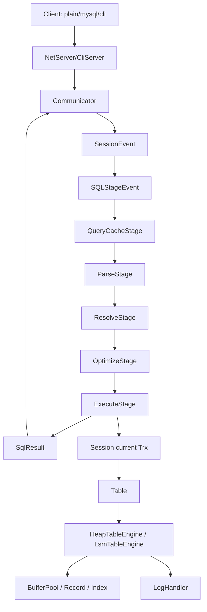
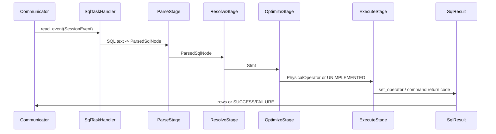
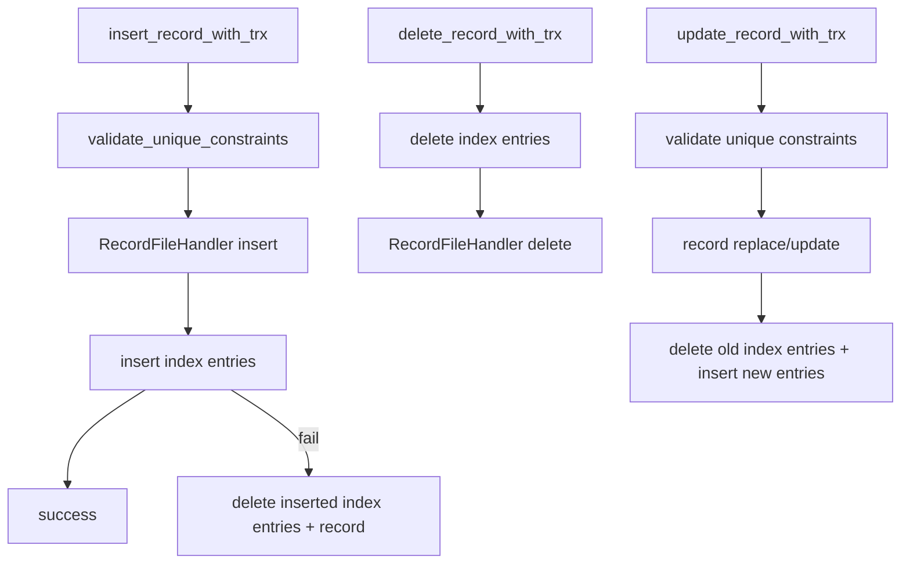
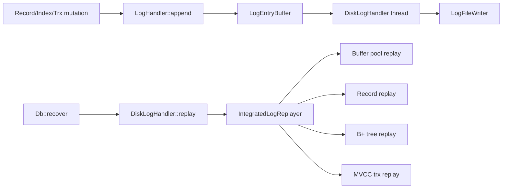

# MiniOB Kernel Architecture

本文档描述当前仓库中的 MiniOB 内核实现，以 `src/observer` 为主，覆盖网络入口、SQL 编译执行、优化器、存储、事务、WAL、索引、LSM 和本地测试体系。内容基于当前代码状态，而不是上游 MiniOB 的抽象设计。

## 1. Overall Shape

MiniOB 当前是一个单进程数据库内核。`observer` 进程启动后初始化全局环境、打开默认 `sys` 数据库，然后监听 plain/MySQL/CLI 协议请求。每条 SQL 通过一条阶段式 pipeline 处理：读包、解析、绑定、重写优化、生成物理计划、执行并回写结果。



The main vertical dependency is:

```text
net/event/session
  -> sql/parser + sql/stmt
  -> sql/optimizer
  -> sql/operator + sql/executor
  -> storage/table + storage/trx
  -> storage/record/index/buffer/clog
```

## 2. Process Startup And Global State

### Entry Point

`src/observer/main.cpp` is the process entry:

- Parses command-line options:
  - `-P plain|mysql|cli` selects protocol.
  - `-t vacuous|mvcc|lsm` selects transaction kit.
  - `-d` enables disk durability.
  - `-E heap|lsm` selects table storage engine.
  - `-T one-thread-per-connection|java-thread-pool` selects thread model.
- Calls `init(the_process_param())`.
- Builds `NetServer` or `CliServer`.
- Calls `serve()`, then `cleanup()`.

### Initialization

`src/observer/common/init.cpp` initializes:

- config from `etc/observer.ini`;
- logging;
- `GlobalContext`;
- `DefaultHandler`.

`GlobalContext` (`src/observer/common/global_context.*`) stores process-wide objects. The important one is `GCTX.handler_`, a `DefaultHandler`.

### DefaultHandler And Database Root

`src/observer/storage/default/default_handler.cpp` manages database directories under:

```text
miniob/db/<db-name>
```

Startup creates/opens the `sys` database and sets it as `Session::default_session()`'s current DB. Multi-database support exists structurally but is intentionally minimal.

## 3. Network, Sessions, And Request Lifecycle

### Server And Communicators

`src/observer/net/server.cpp` accepts TCP or Unix-socket connections and creates one `Communicator` per client:

- `PlainCommunicator` implements MiniOB's null-terminated plain protocol.
- `MysqlCommunicator` implements enough MySQL protocol for sysbench and MySQL-compatible clients.
- `CliCommunicator` serves stdin/stdout mode.

The server delegates connection execution to `ThreadHandler` implementations under `src/observer/net/`.

### Session

`src/observer/session/session.cpp` tracks per-connection state:

- current `Db`;
- current transaction object;
- execution mode flags;
- optimizer flags such as cascade/hash join settings;
- thread-local `Session::current_session()`.

`Session::current_trx()` lazily creates a transaction from the current database's `TrxKit`.

### Request Object Flow

`SqlTaskHandler::handle_event` is the main per-SQL dispatcher:

1. `Communicator::read_event` creates `SessionEvent`.
2. `SessionStage` attaches session/request context.
3. `SQLStageEvent` wraps the SQL string, parsed node, statement and physical operator.
4. `handle_sql` runs:
   - `QueryCacheStage`
   - `ParseStage`
   - `ResolveStage`
   - `OptimizeStage`
   - `ExecuteStage`
5. `Communicator::write_result` drains `SqlResult` and writes protocol output.

`QueryCacheStage` is currently only a pipeline placeholder and returns `RC::SUCCESS` without caching or short-circuiting requests. `PlanCacheStage` also exists in the source tree, but it is not part of the normal `SqlTaskHandler` execution path.



## 4. SQL Frontend

### Parser

The SQL grammar lives in `src/observer/sql/parser/`:

- `lex_sql.l`: lexer source.
- `yacc_sql.y`: grammar source.
- `lex_sql.cpp`, `lex_sql.h`, `yacc_sql.cpp`, `yacc_sql.hpp`: generated parser artifacts.
- `parse_defs.h`: AST-like SQL node structs such as `SelectSqlNode`, `ConditionSqlNode`, `CreateTableSqlNode`.

`ParseStage` calls `parse(sql, ParsedSqlResult*)` and stores one `ParsedSqlNode` in `SQLStageEvent`. Parser errors surface as `RC::SQL_SYNTAX`, which the plain protocol prints as `FAILURE`.

### Statement Binding

`ResolveStage` calls:

```cpp
Stmt::create_stmt(db, *sql_node, stmt)
```

`src/observer/sql/stmt/` binds parsed SQL to schema-aware statement objects:

- `SelectStmt`: resolves tables, projections, filters, group by, having, order by, union, subqueries and aliases.
- `InsertStmt`, `UpdateStmt`, `DeleteStmt`: validate target tables, fields, value expressions, view rewrites and mirror DML.
- `CreateTableStmt`, `CreateIndexStmt`, `Drop*Stmt`, `AnalyzeTableStmt`: DDL command binding.
- `FilterStmt`: turns condition nodes into typed `Expression` trees.

Binding is where field ambiguity, missing table/column, type validation, view DML and subquery correlation are resolved.

## 5. Expression System

Expressions live under `src/observer/sql/expr/` and are used by filters, projections, DML assignments, aggregation, order by and join predicates.

Important expression classes include:

- `ValueExpr`: literal constants.
- `FieldExpr`: table field reference.
- `ComparisonExpr`: `=`, `<>`, `<`, `IN`, subquery comparisons and null-aware comparison behavior.
- `ConjunctionExpr`: AND/OR composition.
- `ArithmeticExpr`: arithmetic and unary expressions.
- `CastExpr`: implicit and explicit type conversion.
- `FunctionExpr`: scalar functions and full-text match scoring.
- `AggregateExpr` and aggregator state classes: `COUNT`, `SUM`, `AVG`, `MIN`, `MAX`.
- `SubQueryExpr`: executes nested query plans and caches/refreshes results as needed.

`Value` and type implementations in `src/observer/common/type/` provide comparison, serialization, null markers, float formatting, date/vector/text behavior and implicit casts.

## 6. Optimization And Planning

### Logical Plan Generation

`LogicalPlanGenerator` converts `Stmt` objects into `LogicalOperator` trees:

- `SelectStmt` becomes:
  - `TableGetLogicalOperator` chain;
  - left-deep `JoinLogicalOperator` for multiple tables;
  - `PredicateLogicalOperator`;
  - `GroupByLogicalOperator`;
  - `OrderByLogicalOperator`;
  - `ProjectLogicalOperator`;
  - optional `UnionLogicalOperator`.
- DML statements become `InsertLogicalOperator`, `UpdateLogicalOperator`, `DeleteLogicalOperator`.
- `ExplainStmt` wraps child plan generation.

The initial logical plan is intentionally simple; much of the placement refinement happens in rewrite rules.

### Rewrite Rules

`OptimizeStage::rewrite` repeatedly applies `Rewriter` rules:

- `ExpressionRewriter`: simplifies/normalizes expression trees.
- `PredicateRewriteRule`: removes constant-true predicate nodes and handles constant-false predicate children.
- `PredicateToJoinRewriter`: moves predicates from filters into join predicates when they reference both join sides; constant predicates on joins are preserved as join predicates.
- `PredicatePushdownRewriter`: pushes table-local predicates into `TableGetLogicalOperator`.

These rules are currently rule-based and mutate the logical tree in-place.

### Physical Plan Generation

`PhysicalPlanGenerator` maps logical operators to tuple-iterator physical operators:

- `TableGet` -> `TableScanPhysicalOperator` or `IndexScanPhysicalOperator`.
- `Join` -> `HashJoinPhysicalOperator` when hash join is enabled and equality keys are found, otherwise `NestedLoopJoinPhysicalOperator`.
- `Project`, `Predicate`, `GroupBy`, `OrderBy`, `Union`, DML and `Explain` map to their corresponding physical operators.

It also has vectorized generation for a subset of operators:

- `TableScanVecPhysicalOperator`
- `ProjectVecPhysicalOperator`
- `GroupByVecPhysicalOperator`
- `AggregateVecPhysicalOperator`
- `ExprVecPhysicalOperator`

`OptimizeStage` selects vectorized generation when `Session` is in `ExecutionMode::CHUNK_ITERATOR` and the logical root supports it. Otherwise it uses tuple iterator mode.

### Cascade Optimizer

`src/observer/sql/optimizer/cascade/` contains an experimental Cascades-style optimizer:

- memo/group structures;
- implementation rules such as logical join to hash join/NLJ;
- cost model;
- task scheduler.

It is enabled per session via `use_cascade`. The non-cascade path remains the default compatibility path for most local cases.

## 7. Execution

### Command vs Query Execution

`ExecuteStage` has two modes:

- If `OptimizeStage` produced a `PhysicalOperator`, `ExecuteStage` moves it into `SqlResult`.
- If no physical plan exists, it calls `CommandExecutor` for DDL, transaction commands, set variables, load data, show tables and other command-style statements.

`SqlResult::open()` starts a transaction if needed and opens the physical operator. `SqlResult::close()` closes the operator and auto-commits or rolls back when not inside explicit multi-statement transaction mode.

### Iterator Contract

Physical operators implement the classic Volcano-style interface:

```cpp
open(Trx *)
next()
current_tuple()
close()
```

Vector operators additionally support `next(Chunk&)`.

Plain protocol output fetches tuples/chunks through `SqlResult`, prints headers from `TupleSchema`, then rows. DDL/DML success/failure is printed as exact `SUCCESS`/`FAILURE`.

### Key Physical Operators

- `TableScanPhysicalOperator`: scans a `RecordScanner`, applies storage/transaction visibility and predicates.
- `IndexScanPhysicalOperator`: uses `IndexScanner` to retrieve RIDs and records.
- `PredicatePhysicalOperator`: evaluates boolean expressions.
- `ProjectPhysicalOperator`: formats selected expressions.
- `NestedLoopJoinPhysicalOperator`: nested loop over two child iterators and evaluates join predicates.
- `HashJoinPhysicalOperator`: builds/probes hash keys and still evaluates residual predicates.
- `GroupByPhysicalOperator`, `HashGroupByPhysicalOperator`, `ScalarGroupByPhysicalOperator`: aggregate/group execution.
- `OrderByPhysicalOperator`: materializes and sorts tuples; supports limit.
- `UnionPhysicalOperator`: union/union all execution.
- `Insert/Update/DeletePhysicalOperator`: DML with transaction calls and optional materialized view mirror maintenance.

## 8. Views

Create view is implemented as materialized view creation in `CommandExecutor::create_materialized_view`:

1. Parse and bind the view's select SQL.
2. Infer output schema from select expressions.
3. Create a physical table for the view.
4. Execute the select plan and insert rows into the view table.
5. Register `ViewDefinition` in `Db`.

`ViewDefinition` records:

- view name;
- base table name;
- view-to-base column mappings;
- predicates for single-table filtered views;
- whether the view is updatable;
- whether it mirrors the full base table.

The view definition registry is process-local in `Db::views_`. The materialized view table is physically created through normal table DDL, but the extra updatability/mirroring metadata is not a standalone persisted catalog.

Current DML rules:

- single-table field-projection views may be updatable;
- multi-table, aggregate/grouped and otherwise unsupported views are not updatable;
- full base-table mirror views are kept synchronized when DML targets base table or view table through mirror plans.

The view implementation is therefore a hybrid: stored as a physical table, but with extra metadata for limited DML rewrite and mirror maintenance.

## 9. Storage Architecture

### Database Object

`Db` (`src/observer/storage/db/db.*`) owns:

- table registry (`opened_tables_`);
- view registry;
- `BufferPoolManager`;
- double-write buffer;
- `LogHandler`;
- transaction kit;
- optional `ObLsm`;
- recovery flow.

Startup order in `Db::init`:

1. Open LSM directory.
2. Create transaction kit.
3. Initialize buffer pool and double-write buffer.
4. Initialize clog handler.
5. Load DB metadata.
6. Open all tables.
7. Recover double-write buffer.
8. Replay logs.

### Table And Engine Split

`Table` is the schema-facing façade. It stores `TableMeta` and delegates storage to a `TableEngine`:

- `HeapTableEngine`: normal page-based heap table.
- `LsmTableEngine`: experimental LSM-backed table engine.

`Table::make_record` converts SQL `Value` arrays to physical record bytes:

- validates column count;
- casts types;
- enforces not-null;
- handles char/vector length;
- stores null markers.

### Heap Engine

`HeapTableEngine` owns:

- `RecordFileHandler` for table data pages;
- `DiskBufferPool` file handle;
- `Index` instances;
- optional LOB handler.

DML flow:



Unique constraints are currently validated by scanning visible records and comparing unique index fields, with null values treated as non-equal for uniqueness.

### Record Pages

`src/observer/storage/record/record_manager.cpp` implements page-level record layout:

- `PageHeader`;
- bitmap of occupied slots;
- row format and PAX format handlers;
- record capacity calculation;
- page initialization and record insertion/deletion logging.

`HeapRecordScanner` iterates pages through `DiskBufferPool` and `RecordPageIterator`. If a transaction is attached, each record is passed through `trx->visit_record` for visibility/concurrency checks.

### Buffer Pool And Double Write

`src/observer/storage/buffer/` contains:

- `DiskBufferPool`: file/page access and page allocation.
- `Frame`: in-memory page frame, dirty state, latches.
- `BufferPoolManager`: manages multiple `DiskBufferPool` files.
- `DiskDoubleWriteBuffer`: double-write recovery support.
- buffer-pool WAL replay modules.

The storage code generally obtains a page frame, latches it, mutates it through record/index handlers, marks it dirty and relies on buffer pool flush/sync paths.

## 10. Indexing And Search

### B+ Tree Index

`BplusTreeIndex` wraps `BplusTreeHandler`:

- create/open index files using the table's `BufferPoolManager`;
- insert/delete entries by extracting indexed field bytes from record data;
- create range scanners returning RIDs.

`PhysicalPlanGenerator` currently chooses an index scan for simple equality predicates where one side is a field and the other side is a literal value.

Index metadata supports:

- single or multi-column declarations through `IndexMeta`;
- unique indexes;
- persistence in table metadata.

### Full-Text Tokenization

Full-text support uses `JiebaTokenizer` under `src/observer/storage/tokenizer/`, built on vendored cppjieba. The tokenizer cuts Chinese text and removes jieba stop words. Query support is implemented through parser/function/expression paths for `MATCH(...) AGAINST(...)` and BM25-like scoring.

### Vector And IVFFlat Stubs

Vector value/type support exists in SQL types and vector search cases. Index headers include `ivfflat_index.h`, but the main visible search behavior is implemented through expression/operator paths rather than a fully integrated production vector index layer.

## 11. Transactions And MVCC

`TrxKit::create` chooses one of:

- `VacuousTrxKit`: no transaction isolation, direct table operations.
- `MvccTrxKit`: heap MVCC using hidden fields.
- `LsmMvccTrxKit`: LSM-specific transaction kit.

### Vacuous Transactions

`VacuousTrx` delegates directly:

- insert -> `table->insert_record`;
- delete -> `table->delete_record`;
- visit -> always visible;
- commit/rollback -> no-op.

This is the simplest default mode.

### Heap MVCC

`MvccTrxKit` adds hidden fields to every table:

```text
__trx_xid_begin
__trx_xid_end
```

Visibility is encoded as:

- positive `begin/end`: committed visibility interval;
- negative `begin`: inserted by active transaction;
- negative `end`: deleted by active transaction.

`MvccTrx` records operations, writes transaction logs and on commit converts negative temporary XIDs into a positive commit XID. Rollback reverses uncommitted operations.

`HeapRecordScanner` invokes `trx->visit_record` so MVCC visibility is enforced during scans. Write mode can return concurrency conflicts when a record is being deleted/modified by another transaction.

## 12. Commit Log And Recovery

The commit log layer is under `src/observer/storage/clog/`.

`LogHandler::create` chooses:

- `DiskLogHandler` for durable disk logging;
- `VacuousLogHandler` for no-op logging.

`DiskLogHandler` has:

- `LogFileManager`;
- `LogEntryBuffer`;
- background flush thread;
- replay by iterating log files from a starting LSN.



`IntegratedLogReplayer` dispatches replay by `LogModule`:

- buffer pool;
- record manager;
- B+ tree;
- transaction.

This makes WAL replay cross-module but still centralized at database startup.

## 13. LSM Subsystem

The standalone LSM code lives in `src/oblsm/`. `Db::init` opens an `ObLsm` instance under the database directory's `lsm/`.

Important pieces:

- `ObLsmImpl`: main DB object;
- `ObMemTable`: skiplist-like mutable memory table;
- `WAL`: LSM write-ahead log;
- `ObSSTable`, `ObBlock`, builders/readers;
- `ObManifest`: snapshots and compaction metadata;
- `ObCompactionPicker` and compaction scaffolding;
- `ObUserIterator`: user-facing iteration.

`ObLsmImpl::put` writes WAL first, then memtable. When memtable exceeds configured size, it freezes the memtable, rotates WAL and schedules background compaction/building of SSTables.

The observer-facing `LsmTableEngine` is currently limited compared with heap: it can write key/value records through `ObLsm`, exposes an LSM scanner, and leaves many table operations unimplemented.

## 14. Testing Architecture

### Unit Tests

`unittest/` contains GoogleTest binaries grouped by:

- `common`;
- `observer`;
- `oblsm`;
- `memtracer`.

CTest runs the built test binaries from `build_debug`.

### SQL Case Runner

`test/case/miniob_test.py` starts `observer`, sends SQL through plain protocol and compares generated output with `test/case/result/*.result`.

Supported case-level commands include:

- `-- echo`;
- `-- sort`;
- `-- connect` / `-- connection`;
- `-- ensure:hashjoin`, `-- ensure:nlj`, etc. for plan assertions.

`test/case/generate_mysql_result.py` uses the competition MySQL server on `/tmp/miniob2026-mysql.sock` to generate many MiniOB-style expected results. It also handles MiniOB-specific directives and known MiniOB2025 oracle semantics such as rejecting DML on multi-table materialized views.

### MiniOB2025 Cases

Current local MiniOB2025 tests live as fused cases under `test/case/test/miniob2025-*.test` with paired result files. The suite includes primary/dblab-derived coverage, official snippets and regression cases from previous failures.

## 15. Important Current Design Constraints

- Output is exact-match sensitive. Protocol formatting and query result order must be deterministic in test cases.
- Parser generated files must follow grammar/lexer source changes.
- Heap storage is the main complete storage path; LSM is experimental.
- MVCC is functional but simplified and still uses per-record hidden fields with coarse conflict semantics.
- Materialized views are physical tables plus metadata-driven DML mirroring, not virtual query expansion views.
- The optimizer is mostly rule-based; cascade optimizer is present but optional.
- WAL/recovery spans buffer, record, B+ tree and transaction modules through module-tagged log entries.

## 16. Quick File Map

```text
src/observer/main.cpp                 process entry and command-line options
src/observer/net/                      protocol, server, thread handling
src/observer/event/                    request/event wrappers
src/observer/session/                  per-connection state and transaction binding
src/observer/sql/parser/               SQL lexer/parser and AST nodes
src/observer/sql/stmt/                 schema binding and statement validation
src/observer/sql/expr/                 expression evaluation and aggregate state
src/observer/sql/optimizer/            logical planning, rewrite, physical planning
src/observer/sql/operator/             logical and physical operators
src/observer/sql/executor/             command executors and SQL result bridge
src/observer/storage/db/               database lifecycle, recovery, view registry
src/observer/storage/table/            Table façade and heap/LSM engines
src/observer/storage/record/           record pages, scanners, row/PAX layout
src/observer/storage/index/            B+ tree index and index metadata
src/observer/storage/buffer/           page cache, frames, double-write
src/observer/storage/clog/             WAL append, flush, replay
src/observer/storage/trx/              vacuous/MVCC/LSM transaction implementations
src/oblsm/                             standalone LSM implementation
test/case/                             SQL case runner and MiniOB2025 cases
unittest/                              GoogleTest/CTest unit coverage
```
